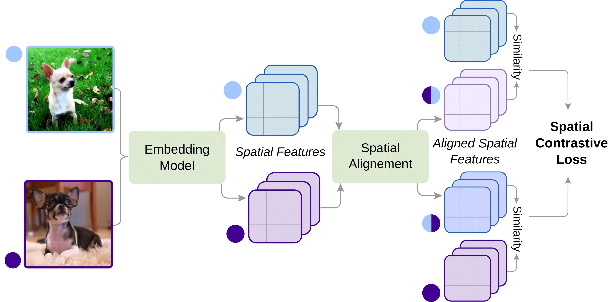

## Spatial Contrastive Learning for Few-Shot Classification (SCL)

### [Paper](https://arxiv.org/abs/2012.13831) :page_with_curl:

This repo contains the official implementation of Spatial Contrastive Learning for Few-Shot Classification (SCL), which presents
of a novel contrastive learning method applied to few-shot image classification in order to learn more general purpose embeddings,
and facilitate the test-time adaptation to novel visual categories.

<p align="center">
  <a href="https://arxiv.org/abs/2012.13831">
    
  </a>
</p>

### Highlights :fire:

**(1) Contrastive Learning for Few-Shot Classification.** \
We explore contrastive learning as an auxiliary pre-training objective
to learn more transferable features and facilitate the test time adaptation for few-shot classification. 

**(2) Spatial Contrastive Learning (SCL).** \
We propose a novel Spatial Contrastive (SC) loss
that promotes the encoding of the relevant spatial information into the learned representations,
and further promotes class-independent discriminative patterns.

**(3) Contrastive Distillation for Few-Shot Classification.** \
We introduce a novel contrastive distillation objective to reduce the compactness of the features
in the embedding space and provide additional refinement of the representations.


### Requirements :wrench:

This repo was tested with CentOS 7.7.1908, Python 3.7.7, PyTorch 1.6.0, and CUDA 10.2. However, we expect that the provided code is compatible with older and newer version alike.

The required packages are `pytorch` and `torchvision`, together with `PIL` and `sckitlearn` for data-preprocessing and evaluation, `tqdm` for showing the training progress, and some additional modules. To setup the necessary modules, simply run:

```bash
pip install -r requirements.txt
```

### Datasets :minidisc:

#### Standard Few-shot Setting

For the standard few-shot experiments, we used ImageNet derivatives: miniImagetNet and tieredImageNet, in addition to CIFAR-100 derivatives: FC100 and CIFAR-FS.
These datasets are preprocessed by the repo of [MetaOptNet](https://github.com/kjunelee/MetaOptNet), 
renamed and re-uploaded by [RFS](https://github.com/WangYueFt/rfs) and can be downloaded from here: [[DropBox]](https://www.dropbox.com/sh/6yd1ygtyc3yd981/AABVeEqzC08YQv4UZk7lNHvya?dl=0)

After downloading all of the dataset, and placing them in the same folder which we refer to as `DATA_PATH`, where each
dataset has its specific folder, eg: `DATA_PATH/FC100`. Then, during training, we can set the training argument `data_root` to `DATA_PATH`.

#### Cross-domain Few-shot Setting

In cross-domain setting, we train on miniImageNet but we test on a different dataset. Specifically, we consider 4 datasets: cub, cars, places and plantae.
All of the datasets can be downloaded as follows:

```shell
cd dataset/download
python download.py DATASET_NAME DATA_PATH
```

where `DATASET_NAME` refers to one of the 4 datasets (cub, cars, places and plantae) and `DATA_PATH` refers to
the path where the data will be downloaded and saved,
which can be the path as the standard datasets above.

### Running :hourglass:

All of the commands necessary to reproduce the results of the paper can be found in `scripts/run.sh`.

In general, to use the proposed method for few-shot classification, there is a two stage approach to follows: (1) training the model on the
merged meta-training set using `train_contrastive.py`, then (2) an evaluation setting, where we evaluate the pre-trained embedding model on
the meta-testing stage using `eval_fewshot.py`. Note that we can also apply an optional distillation step after the 
first pre-training step using `train_distillation.py`.

#### Other Use Cases 

The proposed SCL method is not specific to few-shot classification, and can also be used for
standard supervised or self-supervised training for image classification.
For instance, this can be done as follows:

```python

from losses import ContrastiveLoss
from models.attention import AttentionSimilarity

attention_module = AttentionSimilarity(hidden_size=128) # hidden_size depends on the encoder
contrast_criterion = ContrastiveLoss(temperature=10) # inverse temp is used (0.1)

....

# apply some augmentations
aug_inputs1, aug_inputs2 = augment(inputs) 
aug_inputs = torch.cat([aug_inputs1, aug_inputs2], dim=0)

# forward pass
features = encoder(aug_inputs)

# supervised case
loss_contrast = contrast_criterion(features, attention=attention_module, labels=labels)

# unsupervised case
loss_contrast = contrast_criterion(features, attention=attention_module, labels=None)

....


```

### Citation :pencil:

If you find this repo useful for your research, please consider citing the paper as follows:

```
@article{ouali2020spatial,
  title={Spatial Contrastive Learning for Few-Shot Classification},
  author={Ouali, Yassine and Hudelot, C{\'e}line and Tami, Myriam},
  journal={arXiv preprint arXiv:2012.13831},
  year={2020}
}
```

For any questions, please contact Yassine Ouali.

#### Acknowlegements

* The code structure is based on [RFS](https://github.com/WangYueFt/rfs) repo.
* The cross-domain datasets code is based on [CrossDomainFewShot](https://github.com/hytseng0509/CrossDomainFewShot) repo.


